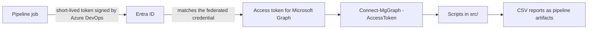

# identity-automation

[](https://github.com/MPreimanis/identity-automation/actions/workflows/ci.yml)

PowerShell scripts for everyday Entra ID admin work: finding inactive accounts, reporting on MFA registration and privileged roles, backing up Conditional Access policies, and handling joiners and leavers. They use the Microsoft Graph PowerShell SDK. You can run them by hand or from Azure Pipelines, where they sign in through workload identity federation instead of a stored client secret.

They're written for a lab or test tenant. There's no real company data in here.

## Scripts

| Script | What it does | Graph permissions |
|---|---|---|
| `Get-InactiveUsers.ps1` | Enabled members with no sign-in for N days (never-used accounts by creation date) | User.Read.All, AuditLog.Read.All |
| `Get-AuthMethodsReport.ps1` | Authentication methods registered per user, with a summary | AuditLog.Read.All |
| `Get-PrivilegedRoles.ps1` | Active and PIM-eligible directory role assignments | RoleManagement.Read.Directory |
| `Get-ExpiringAppCredentials.ps1` | App secrets and certificates that expire within N days | Application.Read.All |
| `Get-StaleGuests.ps1` | Guests who never redeemed or stopped signing in; can disable them | User.Read.All, AuditLog.Read.All (User.ReadWrite.All to disable) |
| `Get-LicenseReport.ps1` | Licence use per SKU and group-based licensing errors | Organization.Read.All, GroupMember.Read.All, User.Read.All |
| `CaPolicyBackup.ps1` | Exports Conditional Access policies to JSON; imports one back in report-only mode | Policy.Read.All (import also needs Policy.ReadWrite.ConditionalAccess) |
| `Invoke-Joiner.ps1` | Creates or updates cloud-only users from an HR export | User.ReadWrite.All, GroupMember.ReadWrite.All, UserAuthenticationMethod.ReadWrite.All |
| `Invoke-Leaver.ps1` | Disables a user, revokes sessions, removes cloud group memberships and logs each step | User.ReadWrite.All, GroupMember.ReadWrite.All |

The sign-in activity and authentication method reports need Entra ID P1 or P2. Eligible (PIM) role assignments need P2.

## Trying it out

Use a lab tenant, not your employer's.

```powershell
Install-Module Microsoft.Graph -Scope CurrentUser

# A read-only report
Connect-MgGraph -Scopes 'User.Read.All', 'AuditLog.Read.All'
./src/Get-InactiveUsers.ps1 -Days 90

# Preview a joiner run: -WhatIf shows every change without making it
Connect-MgGraph -Scopes 'User.ReadWrite.All', 'GroupMember.ReadWrite.All', 'UserAuthenticationMethod.ReadWrite.All'
./src/Invoke-Joiner.ps1 -CsvPath ./data/hr-export-sample.csv -UpnSuffix yourlab.onmicrosoft.com -WhatIf
```

## Running it from Azure Pipelines



1. Create an app registration for the read-only jobs and give it these Microsoft Graph application permissions (with admin consent): User.Read.All, AuditLog.Read.All, RoleManagement.Read.Directory, Application.Read.All and Policy.Read.All.
2. In Azure DevOps, add an Azure Resource Manager service connection called `sc-idauto-read` that uses workload identity federation with that app, scoped to an empty resource group. The Azure scope doesn't restrict Graph. The app's Graph permissions cover the whole tenant.
3. Add the pipelines:

| Pipeline | When | What it does |
|---|---|---|
| `pipelines/ci.yml` | Pushes to `main` (add a branch policy for pull requests) | PSScriptAnalyzer and Pester |
| `pipelines/reports.yml` | Mondays at 05:00 UTC | Runs the reports and publishes the CSV files as an artifact |
| `pipelines/ca-export.yml` | Nightly | Exports Conditional Access policies and commits any change to an `exports` branch |

If the code is on GitHub, Azure Pipelines builds pull requests on its own. In Azure Repos you need a build validation branch policy on `main`.

Point `ca-export.yml` at a private repository, because the exported policies contain object IDs from your tenant. Before the first run, create an `exports` branch from `main` and give the project's Build Service identity Contribute permission on the repo.

## Why it's built this way

- The pipelines use workload identity federation. Anything running on an Azure resource would use a managed identity instead. Either way there's no secret to look after.
- Reports and changes use separate identities. The reports only get read permissions. Anything that writes to the tenant should go through its own service connection with approvals.
- Every change goes through `ShouldProcess`, so `-WhatIf` shows what a run would do before it does it.
- Re-running is safe. The joiner matches people on `employeeId` (names and UPNs change) and only touches what's different.
- Synced users have to be disabled in Active Directory, since a cloud-only change gets undone by the next sync. The leaver script flags that step for you instead of skipping it quietly.
- CI pins Pester and PSScriptAnalyzer to exact versions, so a new release can't suddenly break the build.
- The nightly export commits the Conditional Access policies as JSON. If someone changes a policy in the portal, it shows up as a diff the next morning.

## Tests

GitHub Actions runs PSScriptAnalyzer on `src/` and the Pester tests in `tests/` on pushes to `main` and on pull requests. The tests check that each script parses, requires PowerShell 7.2 or later, lists the Graph permissions it needs and has no hard-coded secrets or object IDs. There are also unit tests for the joiner's helper functions, such as turning Latvian names like "Bērziņš" into clean UPNs and generating passwords without look-alike characters.

```powershell
Invoke-Pester ./tests
Invoke-ScriptAnalyzer -Path ./src -Recurse -Settings ./PSScriptAnalyzerSettings.psd1
```

## Notes

- `Invoke-Joiner.ps1 -IssueTap` prints the Temporary Access Pass to the console. That's fine in a lab. In production it should reach the manager some other way.
- In a hybrid setup, joiners are created in AD and synced up. The joiner script here is for cloud-only users.
- `.gitignore` excludes CSV files apart from the sample, so reports and HR exports don't get committed by accident.

## Licence

MIT
