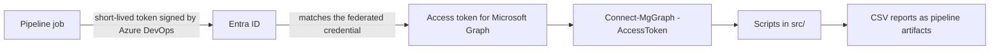

# identity-automation

[](https://github.com/<your-username>/identity-automation/actions/workflows/ci.yml)

PowerShell scripts for day-to-day identity work in Microsoft Entra ID: access reports, joiners and leavers, and Conditional Access backups. They use the Microsoft Graph PowerShell SDK and run from a workstation or from Azure Pipelines. In the pipelines they sign in with workload identity federation, so there is no secret to store, leak or rotate.

Everything was built and tested in a lab tenant. The repository contains no data from a real organisation.

## Scripts

| Script | What it does | Graph permissions |
|---|---|---|
| `Get-InactiveUsers.ps1` | Enabled members with no sign-in for N days (never-used accounts by creation date) | User.Read.All, AuditLog.Read.All |
| `Get-AuthMethodsReport.ps1` | Authentication methods registered per user, with a summary | AuditLog.Read.All |
| `Get-PrivilegedRoles.ps1` | Active and PIM-eligible directory role assignments | RoleManagement.Read.Directory |
| `Get-ExpiringAppCredentials.ps1` | App secrets and certificates that expire within N days | Application.Read.All |
| `Get-StaleGuests.ps1` | Guests who never redeemed or stopped signing in; can disable them | User.Read.All, AuditLog.Read.All (User.ReadWrite.All to disable) |
| `Get-LicenseReport.ps1` | Licence use per SKU and group-based licensing errors | Organization.Read.All, GroupMember.Read.All, User.Read.All |
| `CaPolicyBackup.ps1` | Exports Conditional Access policies to JSON; imports one back in report-only mode | Policy.Read.All (import also needs Policy.ReadWrite.ConditionalAccess) |
| `Invoke-Joiner.ps1` | Creates or updates cloud-only users from an HR export | User.ReadWrite.All, GroupMember.ReadWrite.All, UserAuthenticationMethod.ReadWrite.All |
| `Invoke-Leaver.ps1` | Disables a user, revokes sessions, removes cloud group memberships and logs each step | User.ReadWrite.All, GroupMember.ReadWrite.All |

Sign-in activity and authentication method reports need Entra ID P1 or P2. Eligible role assignments need P2.

## Quick start

Use a lab tenant, not your employer's.

```powershell
Install-Module Microsoft.Graph -Scope CurrentUser

# A read-only report
Connect-MgGraph -Scopes 'User.Read.All', 'AuditLog.Read.All'
./src/Get-InactiveUsers.ps1 -Days 90

# Preview a joiner run: -WhatIf shows every change without making it
Connect-MgGraph -Scopes 'User.ReadWrite.All', 'GroupMember.ReadWrite.All', 'UserAuthenticationMethod.ReadWrite.All'
./src/Invoke-Joiner.ps1 -CsvPath ./data/hr-export-sample.csv -UpnSuffix yourlab.onmicrosoft.com -WhatIf
```

## Running it from Azure Pipelines



1. Create an app registration for the read-only jobs and grant it these Microsoft Graph application permissions, with admin consent: User.Read.All, AuditLog.Read.All, RoleManagement.Read.Directory, Application.Read.All and Policy.Read.All.
2. In Azure DevOps, create an Azure Resource Manager service connection named `sc-idauto-read` that uses workload identity federation with that app, scoped to an empty resource group. The Azure scope doesn't limit Graph: the app's Graph permissions apply to the whole tenant.
3. Add the pipelines:

| Pipeline | When | What it does |
|---|---|---|
| `pipelines/ci.yml` | Pushes to `main` (add a branch policy for pull requests) | PSScriptAnalyzer and Pester |
| `pipelines/reports.yml` | Mondays at 05:00 UTC | Runs the reports and publishes the CSV files as an artifact |
| `pipelines/ca-export.yml` | Nightly | Exports Conditional Access policies and commits any change to an `exports` branch |

When the code lives on GitHub, Azure Pipelines builds pull requests automatically. In Azure Repos, add a build validation branch policy on `main` instead.

Keep `ca-export.yml` pointed at a private repository. Exported policies contain object IDs from your tenant. Before its first run, create the `exports` branch from `main` and give the project's Build Service identity Contribute permission on the repository.

## Design decisions

- Pipelines authenticate with workload identity federation. Jobs that run on Azure resources would use a managed identity. Neither needs a secret.
- Reading and writing use different identities. The reports run with read-only permissions; anything that changes the tenant belongs behind a separate service connection with approvals.
- Every change goes through `ShouldProcess`, so `-WhatIf` shows exactly what a run would do.
- Runs are safe to repeat. The joiner matches people on `employeeId`, because names and UPNs change, and it only changes what differs.
- Synced users are disabled in Active Directory. A cloud-only change would be overwritten by the next sync, so the leaver script reports that step instead of pretending to do it.
- CI installs exact versions of Pester and PSScriptAnalyzer, so a new release can't break the build overnight.
- The nightly export turns Conditional Access drift into a Git diff: a change made in the portal shows up in the commit history the next morning.

## Tests

GitHub Actions runs PSScriptAnalyzer on `src/` and the Pester tests in `tests/` on pushes to `main` and on pull requests. The tests check that every script parses, requires PowerShell 7.2 or later, documents its Graph permissions and contains no hard-coded secrets or object IDs. Unit tests cover the joiner's helpers: turning Latvian names such as "Bērziņš" into clean UPNs, generating passwords without easily confused characters, and retrying calls while new objects replicate.

```powershell
Invoke-Pester ./tests
Invoke-ScriptAnalyzer -Path ./src -Recurse -Settings ./PSScriptAnalyzerSettings.psd1
```

## Notes

- `Invoke-Joiner.ps1 -IssueTap` prints the Temporary Access Pass to the console. That is for a lab. In production the pass goes to the manager through a secure channel.
- In a hybrid environment, joiners are created in Active Directory and reach Entra ID through sync. The joiner here is for cloud-only users.
- `.gitignore` excludes CSV files except the sample, so reports and HR exports don't end up in Git by accident.

## Licence

MIT
